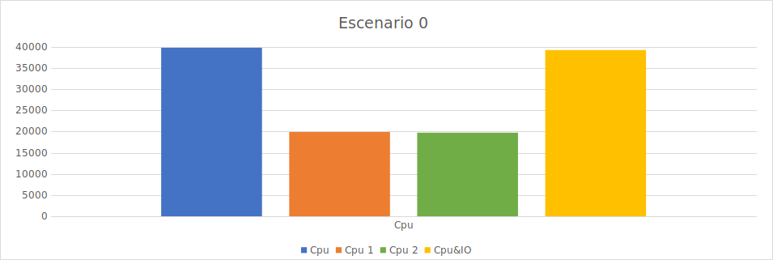
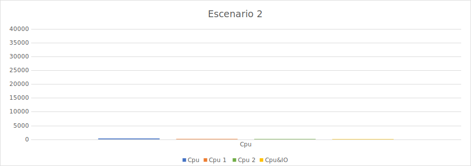
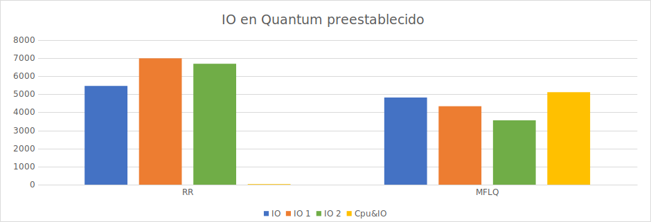
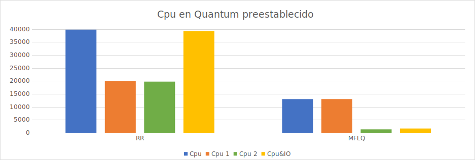
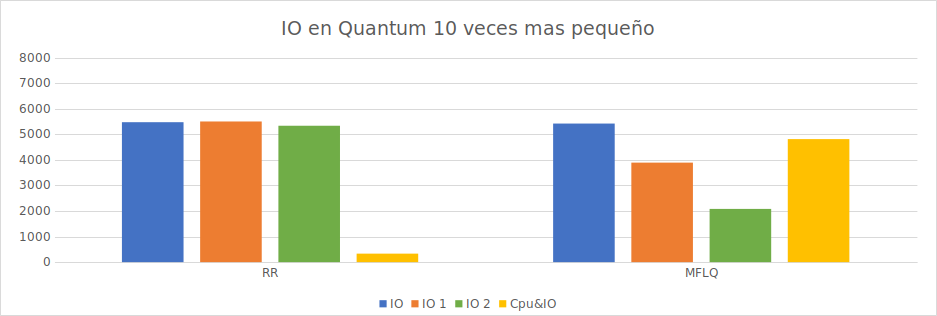
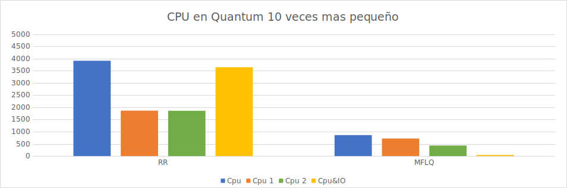
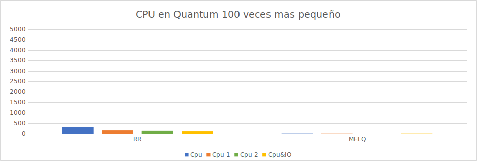
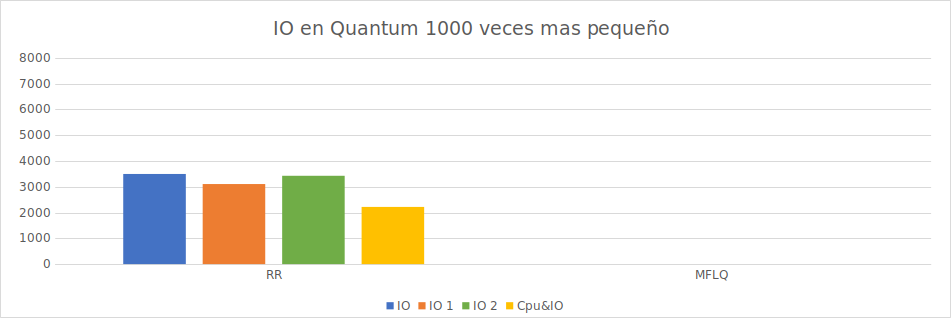
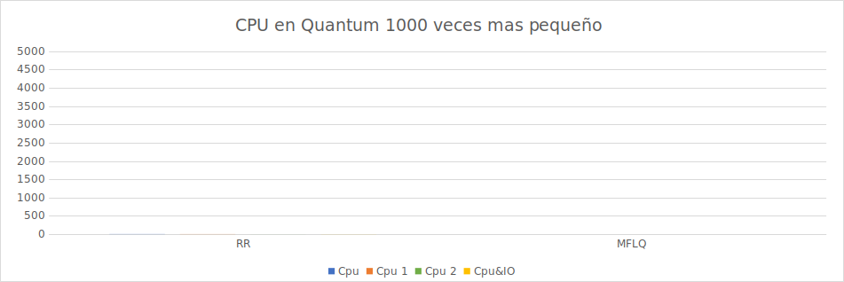

# Laboratorio 3

## **Integrantes**:
Lourdes Mamani (lourdes.mamani@mi.unc.edu.ar).

Gaston Ferrero (gaston.andres.ferrero@mi.unc.edu.ar).

Daniela Courel (daniela.courel@mi.unc.edu.ar).

Agustin Quevedo (rodrigo.quevedo@mi.unc.edu.ar).

## **Introduccion**

En este laboratorio trabajamos sobre el sistema operativo xv6, para comprender y analizar el comportamiento de su planificador estándar y en un segundo momento implementamos cambios para una nueva planificación. 

Analizamos el código de xv6 para entender las funciones que permiten la planificación de procesos y la lógica detrás de ello, luego implementamos los cambios correspondientes para aproximar el planificador al modelo MLFQ y se estudió el rendimiento de ambas para diferentes escenarios.

## **Estudiando el planificador de xv6**
Comenzaremos este laboratorio leyendo código para entender cómo funciona la planificación en xv6: 

1. Analizar el código del planificador y responda: 

¿Qué política de planificación utiliza xv6 para elegir el próximo proceso a ejecutarse? 
xv6 va recorriendo de forma ordenada la lista de procesos y si están runneable (listos para ser ejecutados) los ejecuta hasta que se duerman o pase un cierto intervalo de tiempo. Así,  podemos ver que su comportamiento se correlaciona con las políticas de planificación de un round robin.

2. Analizar el código que interrumpe a un proceso al final de su quantum y responda: 

- a. *¿Cuánto dura un quantum en xv6?*  
Viendo el archivo start.c en la carpeta kernel podemos ver que el quantum se ejecuta 1/10 segundos en quemu (se le asigna 1000000 a la variable interval en la función timerinit())

- b. *¿Cuánto dura un cambio de contexto en xv6?* 
El cambio de contexto corre tan rápido que es difícil medirlo, entre cargar los registros y acceder a memoria, por ello podemos hacer un análisis del camino que lo lleva hasta allí, las interrupciones pueden estar dadas por llamadas a sistemas o por finalización del tiempo del quantum, en total se ejecutan aproximadamente 12 líneas de c y 28 de assembler para llegar y hacer el cambio de contexto, el tiempo que tarda sería lo que podría demorar el procesador en ejecutar esas instrucciones en sus respectivos lenguajes.

- c. *¿El cambio de contexto consume tiempo de un quantum?*  
  Si lo consume los tick de reloj duran una cantidad de tiempo definida por un reloj de hardware (ya sea un reloj físico o emulado), que no se afecta por lo que se está ejecutando en kernel ni user, entonces el cambio de contexto no afecta a esos ticks.

- d. *¿Hay alguna forma de que a un proceso se le asigne menor tiempo?*  
Si un proceso tiene que esperar a un cierto evento (esperar a que otro proceso termine, a que se cierre una punta de escritura que se quiera leer, que se escriba información en el disco duro, etc) antes de seguir usando tiempo de cómputo del cpu xv6 llama a sleep para que el proceso deje de correrse y se ejecute otro, de esa forma intentar que no se desperdicie tiempo de cpu en espera.

## **Rastreando la prioridad de los procesos**

Para la parte tres se agregaron dos campos en la estructura proc, uno para la prioridad (se consideró de 0 a 3, siendo 3 la de mayor prioridad) y una variable que guarda cuantas veces scheduler eligió ese proceso; los dos campos se inicializan en la función procinit, el incremento de la prioridad se hace directamente en la función sleep antes de que llame a sched con un condicional que restringe la prioridad mínima y para el decremento se usó la misma lógica pero en la función yield; el contador se incremente en la función scheduler luego de que el proceso a ejecutar es elegido y se verifica que su estado sea RUNNABLE y antes del swtch. Se fueron haciendo diferentes pruebas corriendo iobench y cpubench para verificar su funcionamiento.

## **Implementando MLFQ**

Para la cuarta parte en vez de usar un puntero para ir recorriendo los procesos en orden se declararon 3 punteros diferentes que cada uno va recorriendo los procesos dentro de ciclo que buscan su respectiva prioridad, pero por cada proceso de prioridad 2 se consultan todos los de prioridad 3, análogamente por cada proceso de prioridad 1 se consultan todos los de prioridad 2 quedando finalmente tres ciclos for anidados para lograr ese comportamiento. Modularizamos la ejecución del proceso en la función execute_procces que contiene todo el código necesario para ejecutar un proceso una vez elegido para no repetir demasiadas veces el mismo código. 

### **Observaciones**:

**Ventajas**: las ventajas de la implementación con punteros se podrían ven en la simpleza de la implementación donde no modificamos significativamente el código de xv6 sino que simplemente modificar la forma en que scheduler selecciona los procesos de la lista intentando imitar el comportamiento de MLFQ, más allá de eso no encontramos una ventaja importante en usar punteros.

**Desventajas**: ocupa tiempo de cómputo donde no se está ejecutando ningún proceso sino simplemente buscando cual seleccionar. Analizando el código y el recorrido que se tiene que hacer para elegir cada proceso vimos que el recorrido para ver cada proceso de prioridad 3 no tiene comparaciones de por medio extras, hasta que llega al final de la lista y hace dos comparaciones más para verificar si hay un proceso de prioridad 2 y 3, entre cada recorrido para buscar un proceso de prioridad 2 se hacen 64 comparaciones buscando una prioridad 3, osea que para ejecutar un proceso de prioridad 2 se tiene que recorrer toda la lista buscándolo (64 comparaciones) y por cada una de ellas se recorre el arreglo para buscar un proceso de 3ra prioridad (64 comparaciones) dando un total de 4096 comparaciones para terminar de verificar todos los procesos de prioridad 2, de esa forma vemos que por cada prioridad extra el costo de recorrer la lista completa buscando esa prioridad es de orden exponencial. En este caso, con tres niveles de prioridad, entre cada ejecución de un proceso de prioridad más baja se tienen que hacer 262144 comparaciones sólo para elegirlo. No sólo tiene un costo altísimo sino que además por cada nivel de prioridad que se quiera ir agregando a la implementación va a ir aumentando exponencialmente el tiempo de cómputo perdido sin ejecutar ningún proceso. 

## **I/O Y poder de computo**

Hicimos varias pruebas en una misma computadora , del cual sacamos un promedio de la cantidad de procesos y los I/O realizados en un **tiempo de ejecucion**.

**CPUbench**:
El cpubench mide la cantidad de multiplicación de matrices (una tarea que es CPU bound), los KFLOPS es una unidad de medida del rendimiento de la computadora (cada 1000 ops), este proceso imprime la cantidad de operaciones.
**IObench**:Iobench imprime la cantidad de operaciones de entrada/salida que se hicieron, en código hace una simulación de cuantas veces se ejecutó la escritura y lectura de un bucle infinito para tomar esta medición.

**aclaración**:Se tamaron 2 mediciones sin correr un proceso externo (sin wifi,ni archivos o pestañas abiertas)
y nos fijamos si las mediciones eran similares.

Notar que en cada caso (cada imagen) se divide en los promedios sacados de las mediciones de CPUbench e IObench donde cada medición representa:
 
**io**  (en la segunda imagen, en azul): representa el caso 0.

**cpu** (en azul): representa el caso 1.

**io1** e **io2**(naranja y verde,respectivamente): caso 3.

**Cpu&IO**(amarillo): dependiendo de cada imagen se hace enfasis en el tipo que tiene la imagen(IO o CPU).
cpu1 y cpu2(naranja y verde): caso 4.
 
Las imágenes se dividen en como fue el comportamiento de la CPU y la IO en los distintos escenarios

Hipotesis: se esperaria que RR tenga una ejecución justa para cada proceso sin importar el tamaño del quantum.

**Primer escenario**:

El primer escenario es en el cual tenemos un quantum normal.

Contrario a lo que pensamos cuando iobench se ejecuta con cpubench, cpubench tiene muchas mas veces que iobench, contrario a lo que pensamos de RR

**Hipótesis con respecto al RR utilizando una cpu**:

Este planificador lo que hace es ir alternando en darle el control a los procesos existentes, lo que se espera es que se ejecute iobench y cpubench la misma cantidad de veces pero que si se ejecutan a la vez iobench al ocupar poco tiempo y devolverle el control al planificador la cantidad de tiempo de tiempo cómputo va a favorecer mucho a los procesos con más tiempo de cpu consecutivo.

**Segundo escenario**:

El segundo escenario es en el cual tenemos un quantum 10 veces mas chico.

Podemos notar que para el caso 1 se ejecutan más veces IO para el caso 0 que cpu para el caso 0 ya que IO puede llamar a la syscal sleep.
para el caso 2 de ambas partes cumple con la hipótesis de RR.
para el caso 4 no se cumple la hipótesis pero son casi similares

**Tercer escenario**:

El tercero escenario es en el cual tenemos un quantum 100 veces mas chico.

Notar que en este caso en el caso 0 y 1 iobench se ejecuta más veces que iobench (siguiendo la hipótesis de IO), en el caso 2 y 3 ambas se ejecutan de forma pareja y en el caso 4 se ejecuta mas veces io, siguiendo la hipotesis

**Cuarto escenario**:

El cuarto escenario es en el cual tenemos un quantum 1000 veces mas chico.

Notamos que en este ultimo escenario para los procesos de la cpu , muchas veces realizaba menos de  1 Kflops, por eso en la grafica no se visualiza nada.

### **Conclusion:**
IO hace muchas llamadas a sistema (llamando a sleep y wakeup) porque sino se pierde tiempo de CPU ya que de no ser así este proceso se estaría ejecutando en tiempo muerto (por el quantum de RR) y para minimizar este tiempo (que es chiquito pero crece a medida que se ejecutan los procesos) llama a sleep y se ahorra tiempo de computo ademas de que esto hace que io se ejecute en menos tiempo.

## **RR vs MLFQ(Sin regla 5)**

Habiendo visto algunos conceptos del teórico sobre planificaciones uno esperaría que RR sea la peor opción si tomamos el tiempo de entrega visto en el teórico, para ello (en el teórico) se habló de MFLQ como “una buena opción”, óptima para ser usada como planificación dependendiendo el caso, veamos que sucede implementando una regla donde se debe: Ascender de prioridad cada vez que el proceso se bloquea antes de terminar su quantum (este comportamiento es distinto al del MLFQ del libro).
Y usando las reglas:

- MLFQ regla 1: Si el proceso A tiene mayor prioridad que el proceso B, corre A. (y no B) 
- MLFQ regla 2: Si dos procesos A y B tienen la misma prioridad, corren en round-robin por el quantum determinado.
- MLFQ regla 3: Cuando un proceso se inicia, su prioridad será máxima. 
- MLFQ regla 4: Descender de prioridad cada vez que el proceso pasa todo un quantum realizando cómputo.

**Quantum preestablecido**

**Quantum 10 veces mas pequeño**

**Quantum 100 veces mas pequeño**

**nota:** en los casos en que ejecutabamos 2 procesos , solo se ejecuto uno.

**Quantum 1000 veces mas pequeño**

En este punto nuestra implementacion de MLFQ , al aplicar el caso de dos cpubench al mismo tiempo , ni siquiera se ejecutaba la consola de xv6, al parecer se pierde mucho tiempo de computo entre los swichs elevados y el orden cubico entre las 3 colas.

**observacion**: Los primeros casos el *iobench* estaba en a prioridad mas alta y a medida que avanzaban los casos la prioridad del mismo iba disminuyendo.

**Aclaración**: La única mejora que notamos fue en los casos donde se ejecutaba iobench y cpubench al mismo tiempo, y MLFQ tomaba como prioridad iobench ya que era un proceso más rápido, lo cual le daba más tiempo de cómputo.

[Datos exactos de los gráficos](https://docs.google.com/document/d/1eb8citNXvY9h5f2WtwiEn8io3ZxI9PqgozvIUBPhTMU/edit#heading=h.x49ezmfced81 "Google docs")

## **Desarrollo**

Nuestra primera prioridad fue analizar el planificador de xv6 , para empezar a generar ideas e hipótesis.
 
Luego dividimos el trabajo en dos grupos de dos personas, uno encargado de las mediciones y otro encargado de la MLFQ.

Para despues desarrollar el informe con el grupo en conjunto. 

## **Conclusiones finales**
A partir del análisis anterior podemos ver que la implementación de MLFQ mejora el rendimiento de los procesos que ceden rápidamente la cpu luego de empezar a ejecutarse, en los casos donde se están ejecutando procesos con mucho uso consecutivo de cpu, aún así el costo de tiempo que tiene para elegir cada proceso lo vuelve bastante ineficiente y reduce mucho el tiempo total de cpu de los procesos, por eso no pareció que podría aportar una mejor interactividad que el planificador original pero aún así no ser una buena implementación ni lo que se buscaría cuando se intenta diseñar un buen sistema operativo que pueda optimizar su funcionamiento lo máximo posible.

Notas: MINTICK y quantum a la hora de las mediciones

Cuando dividimos un quantum por n (n veces más chico) tendremos n veces más interrupciones de reloj, significa que el número de ticks aumenta, entonces, como la operación que se realiza llamada elapsed toma en cuenta el número de ticks que se hicieron al principio menos el número de ticks que se hicieron al finalizar la ejecución este resultado (creo) tiraría un número muy grande con respecto a las interrupciones que se hicieron desde el principio hasta el final (ya que al reducir el quantum se hicieron muchos mas ticks de reloj) para un Minticks(tiempo estándar de tick de reloj) chiquito, entonces los resultados que se imprimirá por pantalla serán bastante chiquitos (en iobench, además de que probablemente se entre varias veces a la guarda del if) y no será el resultado "justo" o esperado, así que, si se modifica el quantum con respecto a cuántas veces fue dividido es necesario modificar Minticks (multiplicarlo) con respecto a las veces que se dividió el quantum para que sea una medición más exacta o "justa".

Aclaración: se tomaron como medidas las 10 primeras mediciones ya que por ejemplo, para el quantum normal corrian mas mediciones que para quantum 1000 veces mas chico, se tomaron 2 mediciones sin correr un proceso externo (sin wifi,ni archivos o pestañas abiertas) y nos fijamos si las mediciones eran similares.

Otra aclaración: Decidimos no tomar mediciones por intervalos de tiempo ¿porque? a medida que tomábamos mediciones notamos que para los distintos escenarios y distintas planificaciones en algunos casos se tardaba mucho tiempo en imprimir los resultados, sobretodo para los casos de los últimos escenarios (escenario 3 por ejemplo)
